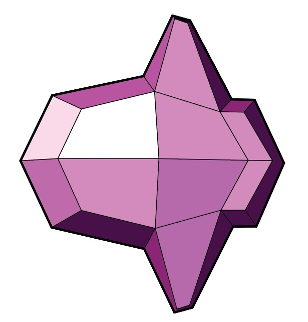
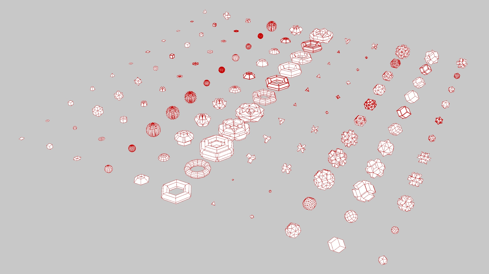
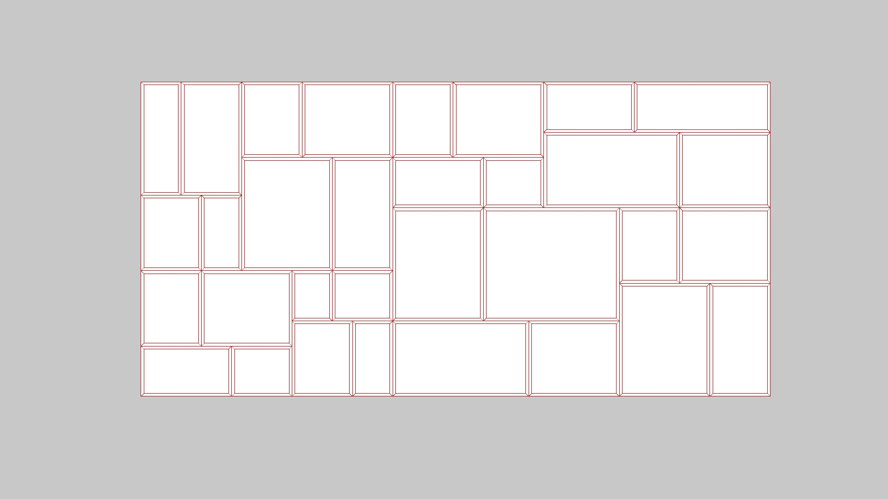
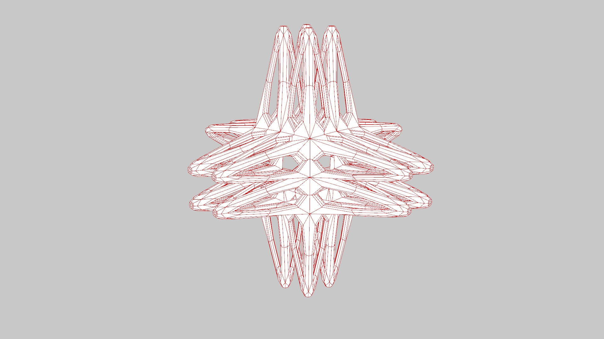
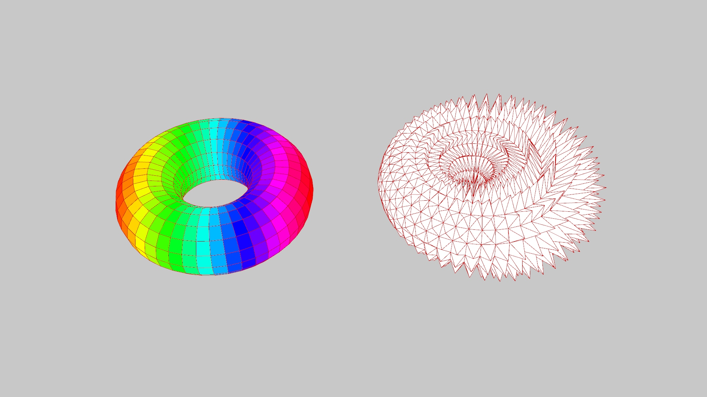
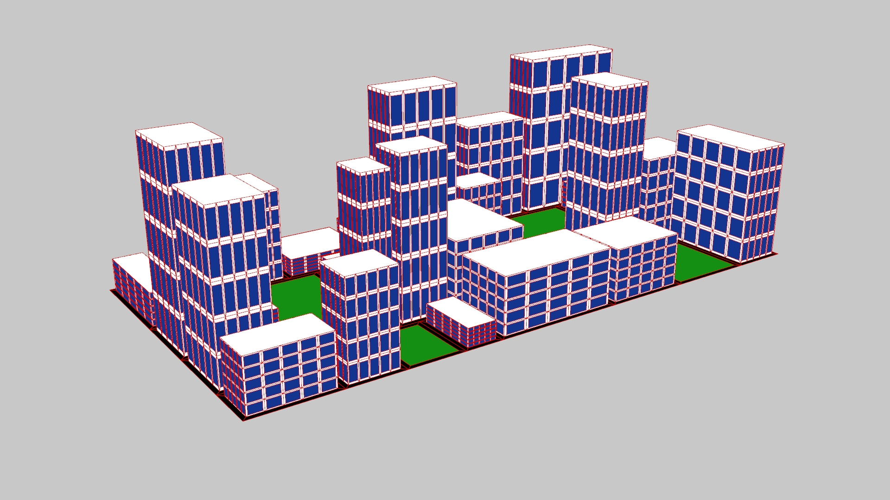
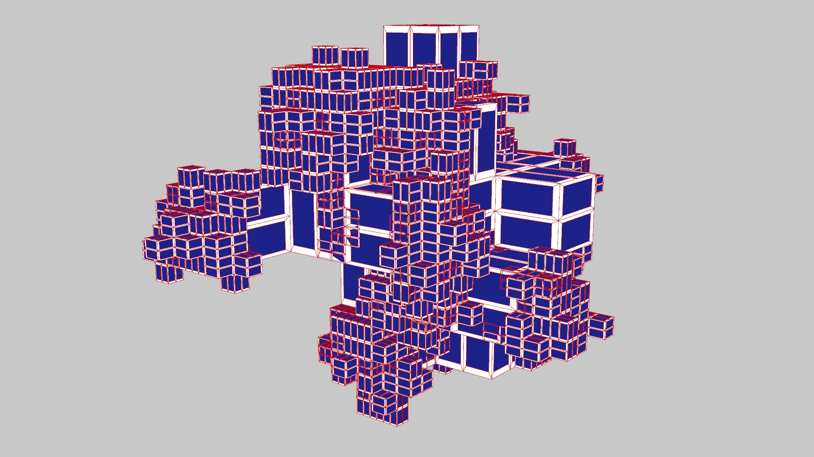

Mola GH
=======

Mola is a plugin for Rhino Grasshopper that provides a set of components for rule-based mesh subdivision. Mesh subdivision algorithms iteratively refine a coarse polygonal mesh by replacing a face with a set if new faces, developing simple meshes into intricate, highly detailed forms. By combining multiple subdivision rules, Mola enables the generation of complex geometries from relatively minimal input.

Mola's components are categorized into four main groups:
* Primitives: A collection of basic 2D and 3D mesh templates.
* Subdivision Methods:Functions for applying mesh subdivision and transformation.
* Analysis: Tools for evaluating mesh face properties, such as normals, surface area, and compactness. These metrics can be used as filters to seperate mesh face subsets for differential operations.
* Utilities: Helper functions for filtering face subsets, splitting and merging meshes, converting between Mola and Rhino meshes, and serializing/deserializing Mola meshes.

Mola is also compatible with other Grasshopper components and customized scripting nodes, allowing for advanced operations.

Links
------

🔗 Dowload: https://github.com/dbt-ethz/HDMolaGH/releases/tag/1.0.0

🔗 API: https://dbt-ethz.github.io/HDMolaGH/

🔗 GitHub: https://github.com/dbt-ethz/HDMolaGH

Platform
--------
Grashopper for Rhino 6, 7, 8. Win and Mac.

Examples
--------
Gallery

Subdivide from a quad

Subdivide from a cube

Subdivide by values

Subdivide by filters

Subdivide by random filters

